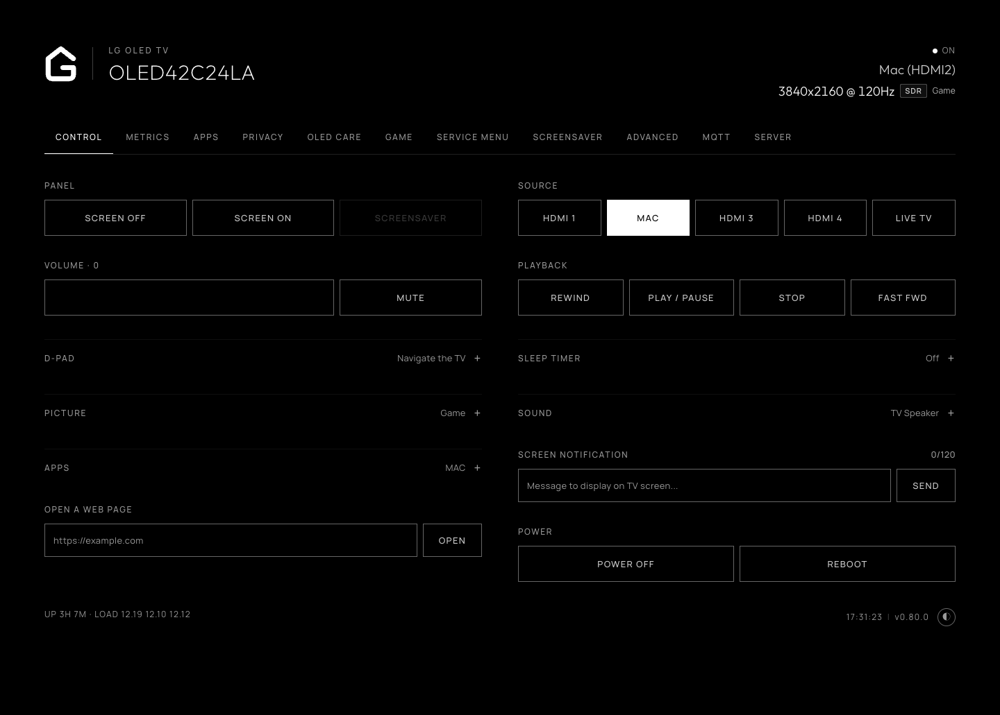

# Control

The **Control** tab, `/?tab=control`, turns the TV into a locally controlled device over the home network, operating directly with webOS without relying on LG's cloud services or mobile applications.

## Navigation and playback

* **D-pad navigation:** Directional arrows (Up, Down, Left, Right), OK/Select, Back, and Home to navigate webOS menus and built-in interfaces.
* **Media playback:** Dedicated transport controls (Play, Pause, Stop, Rewind, Fast Forward) for active media players.
* **Volume and mute:** Volume slider, precision step buttons (`+` and `-`), and a one-click mute toggle.
* **Source selection:** One-click switching across active TV inputs, including HDMI ports and Live TV.

## Picture and sound

* **Picture mode presets:** Instant switching between calibrated picture modes (such as Cinema, Filmmaker, ISF Expert, Game Optimizer). The presets offered adapt dynamically to what is currently playing, displaying Dolby Vision presets for Dolby Vision content and HDR presets for HDR signals.
* **OLED light and backlight:** Live slider adjusting the panel luminance level for the active picture mode.
* **Energy saving:** Quick toggles for Auto, Off, Minimum, Medium, Maximum, and Screen off energy-saving states.
* **Sound output routing:** Switch audio output between TV Speaker, HDMI ARC, Optical, Headphone, and Bluetooth.

## Panel, timers and power

* **Screen blanking:** **Screen off** turns off the OLED or LCD panel immediately while audio and background services continue running. **Screen on** or any remote interaction restores the picture.
* **Screensaver:** Triggers the configured screensaver directly on the TV.
* **Sleep timer:** Sets a timed shutoff (Off, 10, 30, 60, 90, or 120 minutes).
* **Power and reboot:** Switches the TV between standby and on, or performs a full operating system reboot.

## Apps, web and notifications

* **App launcher:** Launch installed webOS applications directly from the dashboard grid.
* **Screen notifications:** Send instant on-screen toast notifications (up to 120 characters) to display messages on the TV.
* **Open a web page:** Enter any HTTP or HTTPS URL to launch it immediately in the TV's native web browser.

*The Control tab: local remote navigation, playback, inputs, picture presets and power.*
