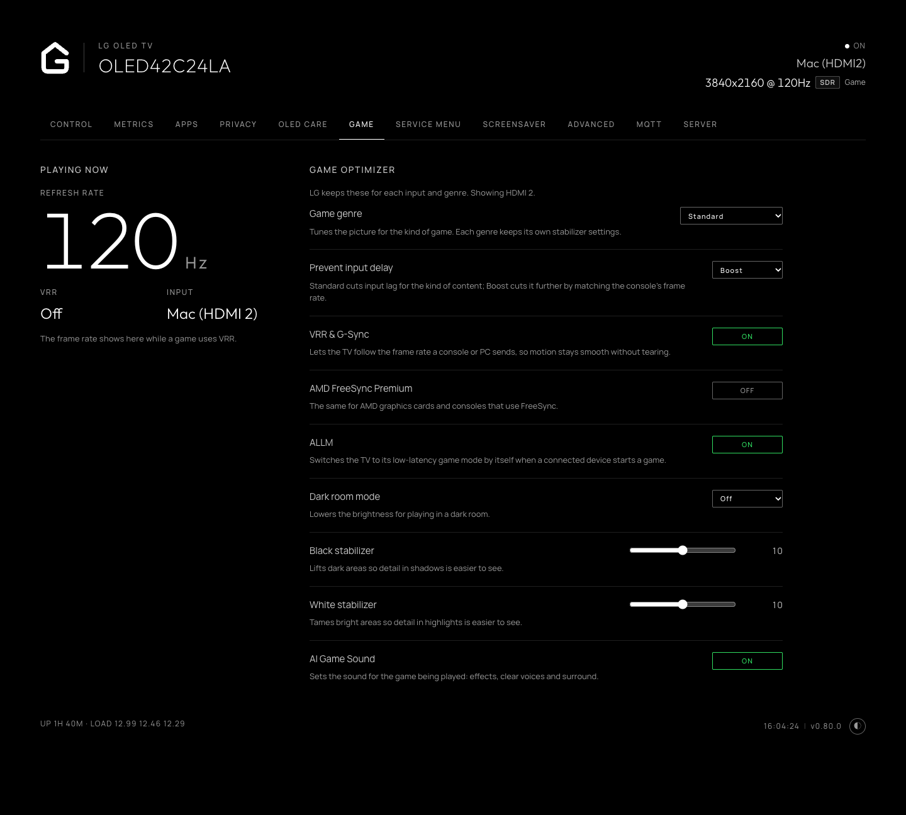

# Game

On TVs with LG's Game Optimizer, the **Game** tab, `/?tab=game`, shows the frame rate of a game in large type while the source uses VRR, and the signal's refresh rate otherwise. Beside it are the Game Optimizer's settings: game genre, prevent input delay, VRR & G-Sync, AMD FreeSync Premium, ALLM, dark room mode, the black and white stabilizers, and AI Game Sound. LG keeps them for each input and genre, and applies them while the picture mode is Game Optimizer. The TV dashboard has the same settings under **Game**.

*Game Optimizer controls, refresh rate and VRR status.*
